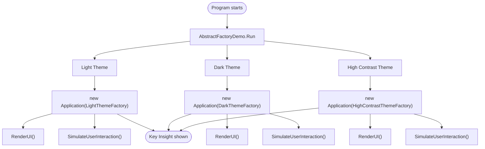
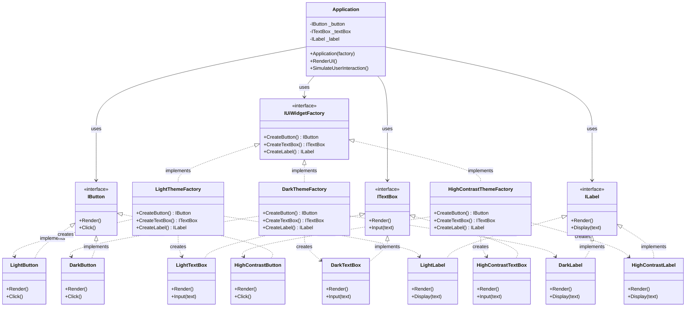
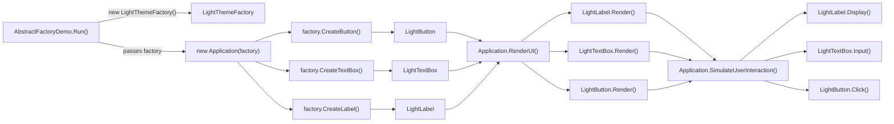

# Abstract Factory Pattern

This project demonstrates the **Abstract Factory** pattern using a UI theme system. You can switch between **Light**, **Dark**, and **High Contrast** themes, and every widget in the application automatically matches the chosen theme.

Run it with:

```bash
dotnet run --project AbstractFactory/AbstractFactory.csproj
```

---

## What is Abstract Factory?

The Abstract Factory pattern lets you create **families of related objects** without specifying their concrete classes.

**Real-world analogy:** Think of IKEA furniture sets. A "Kallax factory" gives you a Kallax shelf + Kallax drawers that fit together perfectly. A "Billy factory" gives you a Billy shelf + Billy doors. You never mix parts from different sets because they won't fit.

In this project:
- **LightThemeFactory** creates LightButton + LightTextBox + LightLabel (all light-themed)
- **DarkThemeFactory** creates DarkButton + DarkTextBox + DarkLabel (all dark-themed)
- **HighContrastThemeFactory** creates HighContrastButton + HighContrastTextBox + HighContrastLabel (all high-contrast)

---

## Overall Project Flow



---

## Complete UML Class Diagram



---

## How One Theme Flows (Light Theme Example)



The same flow applies for **Dark Theme** and **High Contrast Theme** — the only difference is which factory is passed to `Application`.

---

## Key Concepts

| Concept | How it's shown here |
|---|---|
| **Abstract Factory Interface** | `IUiWidgetFactory` — declares `CreateButton()`, `CreateTextBox()`, `CreateLabel()` |
| **Product Interfaces** | `IButton`, `ITextBox`, `ILabel` — each widget type has its own contract |
| **Concrete Factories** | `LightThemeFactory`, `DarkThemeFactory`, `HighContrastThemeFactory` — each creates a matching family |
| **Concrete Products** | `LightButton`, `DarkTextBox`, `HighContrastLabel`, etc. — actual widget implementations |
| **Client** | `Application` — receives a factory, creates widgets, never knows concrete types |
| **Family Consistency** | Light factory always creates light widgets; dark factory always creates dark widgets |

---

## Why This Pattern Matters

- **You can swap entire families** by changing one line: `new Application(new DarkThemeFactory())` instead of `new Application(new LightThemeFactory())`
- **Products are guaranteed to be compatible** — you'll never accidentally pair a dark button with a light label
- **The client is decoupled** from concrete classes — it only depends on interfaces
- **Adding a new theme** means creating a new factory + new widget classes — no existing code is modified

---

## Files in this project

| File | What it contains |
|---|---|
| `Program.cs` | Application entry point |
| `Patterns/AbstractFactory/Products.cs` | `IButton`, `ITextBox`, `ILabel` interfaces + all concrete widget implementations |
| `Patterns/AbstractFactory/WidgetFactory.cs` | `IUiWidgetFactory` interface + `LightThemeFactory`, `DarkThemeFactory`, `HighContrastThemeFactory` |
| `Patterns/AbstractFactory/Application.cs` | The client — uses the factory to create and interact with widgets |
| `Patterns/AbstractFactory/AbstractFactoryDemo.cs` | Runs the demo for all three themes |
