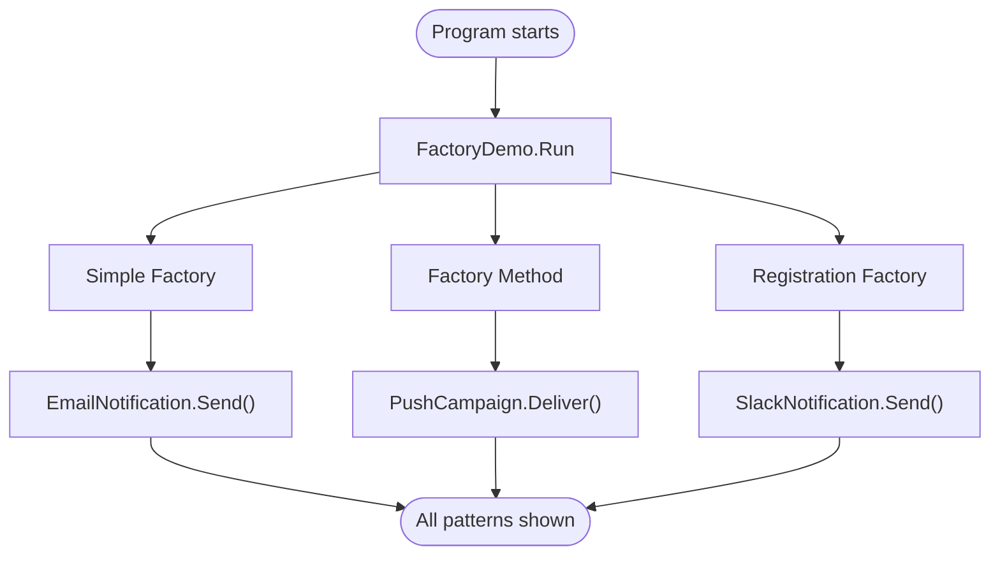
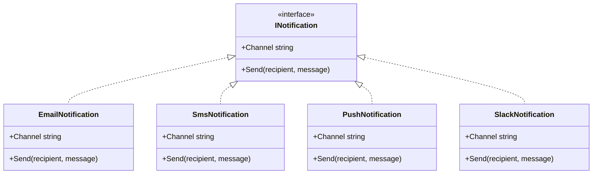
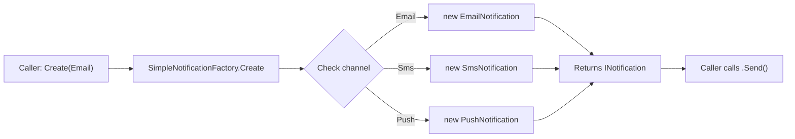
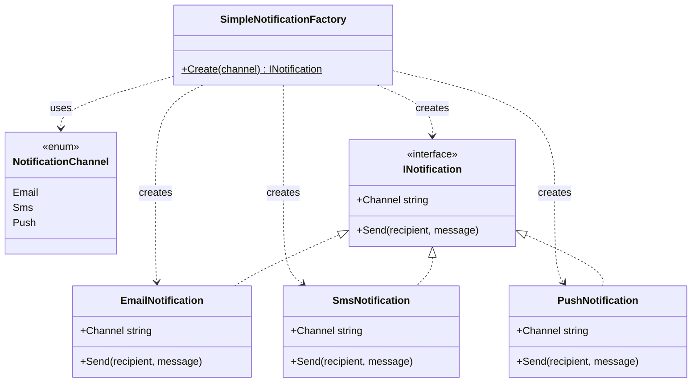
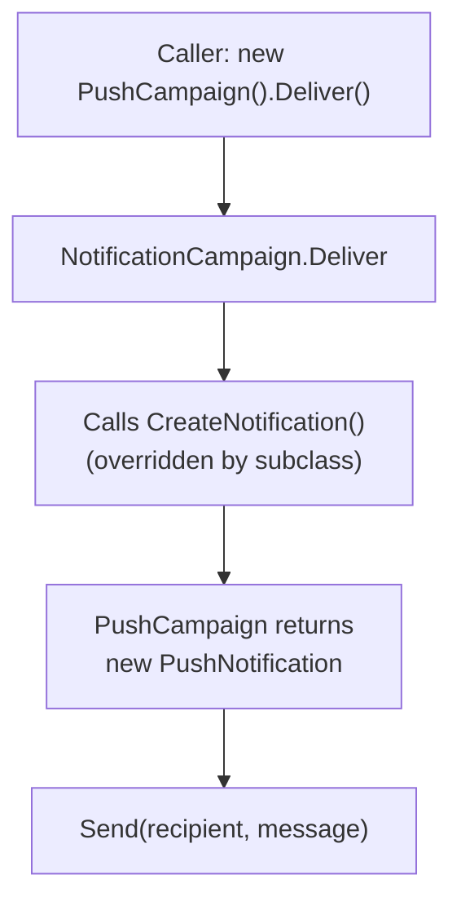
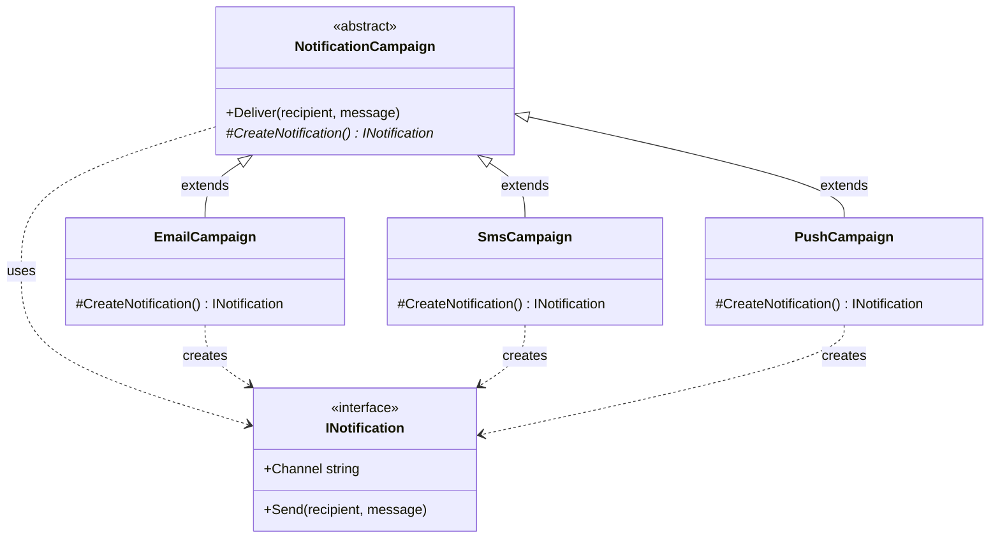
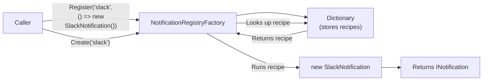
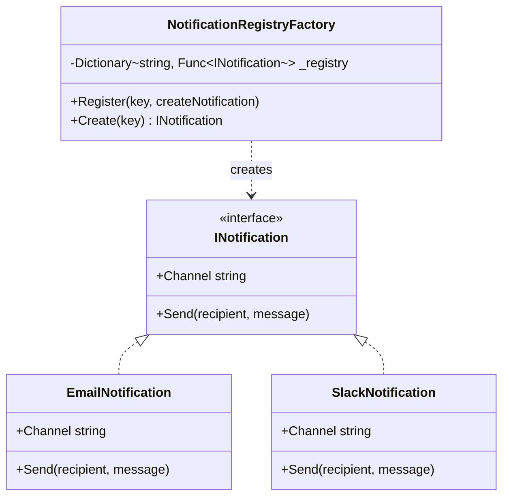

# Factory Pattern

This project demonstrates three factory pattern concepts in C# with easy-to-understand code:

1. **Simple Factory** — one method creates different objects based on a parameter
2. **Factory Method** — subclasses decide which object to create
3. **Registration-Based Factory** — add new object types without editing existing code

Run it with:

```bash
dotnet run --project FactoryPattern/FactoryPattern.csproj
```

---

## Overall Project Flow



---

## Overall Class Structure (UML)



All notification types (`Email`, `SMS`, `Push`, `Slack`) implement the same `INotification` interface. Each factory pattern creates these objects differently.

---

## 1. Simple Factory

**File:** `Patterns/Factory/SimpleNotificationFactory.cs`

The simplest factory — one static method that returns different objects based on an enum value.

### How it flows



### Class structure



### Key points for beginners

- **You pass an enum value**, you get an object back. No `new` needed on your side.
- **All creation logic is in one place** — easy to find and change.
- **Downside:** To add a new type (like `Slack`), you must edit the switch statement inside the factory. This breaks the "Open/Closed Principle" (code should be open for extension but closed for modification).

---

## 2. Factory Method

**File:** `Patterns/Factory/FactoryMethodExample.cs`

A base class defines the steps of a workflow, but subclasses decide which specific product to create.

### How it flows



### Class structure



### Key points for beginners

- **The base class** (`NotificationCampaign`) contains the shared workflow (`Deliver`).
- **The factory method** (`CreateNotification`) is `abstract` — subclasses must provide their own version.
- **Each subclass** decides what to create: `EmailCampaign` creates `EmailNotification`, `PushCampaign` creates `PushNotification`, etc.
- **Benefit:** To add a new type, just create a new subclass. You don't change any existing code.

---

## 3. Registration-Based Factory

**File:** `Patterns/Factory/NotificationRegistryFactory.cs`

Stores creation "recipes" in a dictionary. Add new recipes at runtime without changing the factory.

### How it flows



### Class structure



### Key points for beginners

- **Instead of a switch statement**, this factory uses a `Dictionary` (like a phonebook) that maps names to creation functions.
- **`Register()` adds a recipe.** You give it a name ("slack") and a function that creates the object.
- **`Create()` looks up the recipe** and runs it to get a new object.
- **Benefit:** You can add new types from anywhere — even from outside the factory class. No modification of existing code is needed.
- **This is the most flexible** of the four patterns. It's used in plugin systems and dependency injection containers.

---

## Summary

| Pattern | How it creates objects | Adding new types | Flexibility |
|---|---|---|---|
| **Simple Factory** | Switch statement on an enum | Edit the switch (breaks Open/Closed) | Low |
| **Factory Method** | Subclass overrides a method | Add a new subclass | Medium |
| **Registration Factory** | Dictionary of delegates at runtime | Call Register() anywhere | Highest |

## Files in this project

| File | What it contains |
|---|---|
| `Program.cs` | Application entry point |
| `Patterns/Factory/Notifications.cs` | `INotification` interface + concrete types |
| `Patterns/Factory/SimpleNotificationFactory.cs` | Simple Factory pattern |
| `Patterns/Factory/FactoryMethodExample.cs` | Factory Method pattern |
| `Patterns/Factory/NotificationRegistryFactory.cs` | Registration-Based Factory pattern |
| `Patterns/Factory/FactoryDemo.cs` | Runs all pattern demonstrations |
